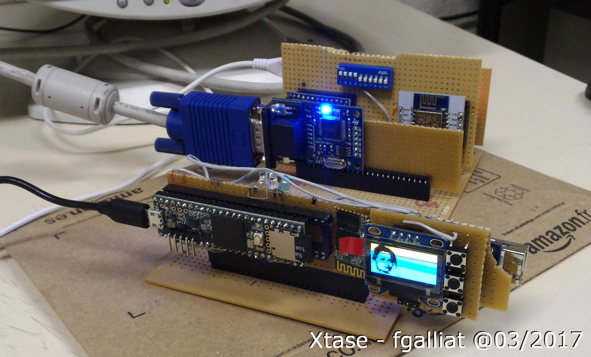

# BasicAr
Basic for Arduino'ish MCUs (Xtase version)

**Initialy based on _Robin Edwards_ work (https://github.com/robinhedwards/ArduinoBASIC)**

Originally designed for **Teensy serie** (3.2 & 3.6 tested)

The hardware driver layout isn't finished & is provided as is (coded for the XtsUBasic board :><br/>
 https://hackaday.io/project/19223-xts-ubasic<br/>
 http://xtase.over-blog.com/2017/02/xts-ubasic-starting-mother-board/debuts-de-la-carte-mere.html)


## Builtin hardware :
 * Teensy 3.6 180MHz 256KB ram MCU
 * Buzzer
 * SSD1306 OLED 128x64 I2C Display
 * HC-06 BT slave UART
 * HobbyTronics USB Keyboard UART interface
 * 3 LEDS
 * 3 push buttons
 * own-designed BUS to deal w/ peripheral cards


### Initial command set :
```
 AND,OR, NOT,MOD
 PRINT -----------------------> ADDED <?> shortcut
 CLS
 LIST,RUN
 GOTO,GOSUB,RETURN,
 REM, ------------------------> ADDED <'> shortcut
 STOP,CONT,PAUSE
 INPUT, INKEY$ // INKEY$ : non blocking key listening ....
 IF,THEN
 FOR,TO,STEP,NEXT
 VAL()
 INT(),RND() // int(1.5) -> rounds to 1 / rnd() -> returns between 0.00 & 1.00
 STR$()      // STR$(1) => "1" (allows string concat)
 LEN(),      // LEN("abc") => 3 
 RIGHT$(),MID$(),LEFT$(),
 POSITION, 
 LET,DIM,
 PIN, PINMODE,PINREAD,ANALOGRD
 SAVE,LOAD,NEW
 DIR,DELETE ---------------> TODO : FILES as DIR alias
```

### Extended command set :
```
' for REM
? for PRINT
MEM               : function to return free mem ammount ----------> <*> shortcut to display it
         
LOCATE <ROW>,<COL>

FS_SUPPORT for Teensy3.6 w/ SDCard
DIR/FILES (in progress)
SAVE/LOAD/LLIST

MUTE (toggle mute buzzer)
TONE 100,2        : 0-48 produces some notes, else direct freq. is used, tones for '2' * 50msec
PLAY "ABC#"       : play some notes of OCTAVE_4
PLAYT5K & PLAYT53 : to play audio files
DRAWBPP           : display a 1bpp picture to builtin screen
         
BTN(x)            : function get button state
LED [1..3], {0,1} : switch on/off a LED
         
ECHO {0;1}        : enable/disable console output
DELAY x           : wait x msec
BYE               : to reset the MCU
```

(The code is a bit dirty @ this time, I know)<br/>
This work is still in progress ... (so see you @ anytime)